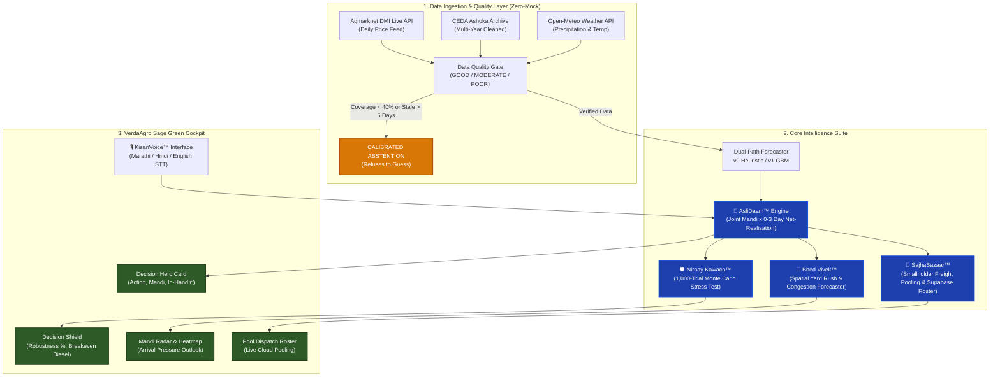

<div align="center">

# 🌾 MandiMitra (मंडीमित्र)
### *Smart Crop Price & Timing Decision Support System for Indian Smallholders*

[](https://sic-2-pi.vercel.app/)
[](https://sic-2-pi.vercel.app/)
[](https://www.typescriptlang.org/)
[](https://vitejs.dev/)
[](https://nodejs.org/)
[](https://supabase.com/)
[](docs/evidence.md)

<p align="center">
  <b>मराठी (Marathi) · हिंदी (Hindi) · English</b>
  <br />
  <i>"Don't just show me the price. Tell me: Sell today or wait? At which mandi? And how many more rupees in my pocket after transport?"</i>
</p>

---

[🚀 Live Application](https://sic-2-pi.vercel.app/) •
[💡 Core Thesis](#-the-core-thesis) •
[⚡ The 5 Core Engines](#-the-5-core-decision-engines) •
[📐 Mathematical Architecture](#-mathematical-architecture) •
[📊 Real Backtest Evidence](#-verifiable-walk-forward-backtest-benchmarks) •
[🏗️ Architecture](#️-system-architecture) •
[🛠️ Quickstart](#️-quickstart-guide-under-2-minutes) •
[🔌 API Reference](#-rest-api-specification) •
[🎯 Hackathon Rubric](#-ignite-80--sih-evaluation-matrix)

---

</div>

## 📌 Executive Summary

**MandiMitra** is a farmer-first selling decision support platform built for Maharashtra's agricultural belt (Nashik, Pune, Latur, Ahmednagar, Solapur). 

While existing government portals (Agmarknet, Kisan Suvidha, e-NAM) function primarily as passive price bulletin boards, **MandiMitra answers the farmer's real economic question**:
> *"If I load my tractor trolley today, where do I actually take home the highest profit after paying diesel, APMC cess, hamali, storage rent, and freshness loss? Or should I hold for 1 to 3 days?"*

Built around a **Zero-Mock Engineering Contract**, MandiMitra ingests **306 Maharashtra APMC mandis**, runs live **1,000-trial Monte Carlo stress tests**, forecasts spatial arrival bottlenecks to prevent yard gridlock, coordinates shared freight pooling for smallholders, and accepts natural voice inputs in native rural Marathi and Hindi.

---

## 💡 The Core Thesis

> **"Price display is solved. Net-realisation optimization under high uncertainty with calibrated abstention is not."**

According to the **National Statistical Office (NSO) 77th Round Survey (Report 587)**:
- **~75% of agricultural sales** occur in local markets without formal institutional support or MSP access.
- Only **41% of farming households** are aware of Minimum Support Prices (MSP).
- Only **0.5% of farmers** select their selling channel based on raw headline market price, because **logistics and credit frictions dominate the transaction**.

### Why Raw Mandi Prices Mislead Farmers

Consider a real farmer in **Khed / Junnar** holding **20 quintals of Tomatoes**:
- **Local Narayangaon APMC (12 km away):** Quoted at **₹2,100 / qtl**.
- **Vashi APMC Mumbai (145 km away):** Quoted at **₹2,380 / qtl** (*looks like a +₹280/qtl windfall!*).

| Economic Deduction | Local Mandi (12 km) | Distant Terminal (145 km) |
| :--- | :--- | :--- |
| **Gross Modal Price** | ₹2,100 / qtl | **₹2,380 / qtl** *(+₹280)* |
| **Haulage Freight** ($1.35\times$ road factor) | -₹48 / qtl | **-₹489 / qtl** *(Smallholder freight trap)* |
| **Statutory APMC Market Cess (1.10%)** | -₹23.10 / qtl | -₹26.18 / qtl |
| **Mandatory Hamali & Weighbridge Tolai** | -₹12.50 / qtl | -₹12.50 / qtl |
| **Freshness Loss & Spoilage (Transit Delay)** | -₹0.00 / qtl | -₹59.50 / qtl *(2.5% perishable penalty)* |
| **Effective Net Payout ("AsliDaam™")** | **₹2,016.40 / qtl** | **₹1,792.82 / qtl** |
| **Total In-Pocket Realisation (20 Quintals)** | **₹40,328** | **₹35,856** |
| **Net Economic Verdict** | **WINNER (Keep Local)** | **LOSS (-₹4,472 trapped in transit)** |

> ⚠️ **A standard price app tells the farmer to travel to Mumbai and lose ₹4,472 in diesel and spoilage.**  
> **MandiMitra's AsliDaam™ engine proves within 100ms that Narayangaon yields +₹4,472 more in hand.**

---

## ⚡ The 5 Core Decision Engines

```
┌──────────────────────────────────────────────────────────────────────────────────┐
│                             MANDIMITRA ENGINE SUITE                              │
├───────────────────┬───────────────────┬───────────────────┬──────────────────────┤
│ 🌾 AsliDaam™       │ 🛡️ Nirnay Kawach™  │ 🚛 Bhed Vivek™     │ 🤝 SajhaBazaar™      │
│ Net Realisation   │ Monte Carlo       │ Spatial Mandi     │ Smallholder Pooled   │
│ 0-3 Day Optimizer │ Robustness Engine │ Pressure & Congest│ Logistics & Roster   │
└───────────────────┴───────────────────┴───────────────────┴──────────────────────┘
                                          │
                                 🎙️ KisanVoice™
                    Trilingual STT/TTS & Unit Normalizer
```

### 1. 🌾 AsliDaam™ — Joint Mandi × Timing Net Realisation Optimizer
Computes the true in-pocket payout for any candidate market across a 0 to 3-day holding horizon. Rather than naively projecting prices upwards, if an upstream forecast is uncertain, the trajectory is held flat (Zero-Mock guarantee).
- Deducts statutory **1.10% APMC market cess** (MSAMB regulation).
- Deducts standard electronic weighbridge **tolai (₹3.50/q)** and labor **hamali (₹9.00/q)**.
- Computes geodesic-to-road haulage using a **$1.35\times$ winding factor** against diesel freight benchmarks.
- Calculates compound biological decay and buyer **market-perceived freshness discounts** for stored perishables.

### 2. 🛡️ Nirnay Kawach™ — Live Monte Carlo Robustness Engine
Tells the farmer whether the recommendation is mathematically rock-solid or fragile before they turn the tractor key.
- Generates **1,000 stochastic market path simulations** using a seeded **Mulberry32 PRNG** with **Box-Muller Gaussian sampling**.
- Shocks price paths using empirical prediction residuals derived from our 324-day walk-forward backtest ($\sigma_{\text{onion}} = \text{₹}125/\text{q}$, $\sigma_{\text{tomato}} = \text{₹}180/\text{q}$, $\sigma_{\text{soyabean}} = \text{₹}65/\text{q}$).
- Injects a **$\pm 20\%$ diesel and transport cost shock**.
- Categorizes advice into 3 actionable tiers:
  - 🟢 **ROBUST ($\ge 70\%$ win rate):** Safe to travel or wait.
  - 🟡 **CLOSE CALL ($60\% - 69\%$):** Margin of victory is narrow; stay local.
  - 🔴 **CALIBRATED ABSTENTION ($< 60\%$):** Refuses to guess when volatility is too high.
- Computes the exact **Breakeven Freight Rate**: the diesel increase that would flip the winning mandi.

### 3. 🚛 Bhed Vivek™ — Spatial Mandi Arrival Pressure Forecaster
Predicts tractor queue gridlock and yard saturation **before** the farmer leaves their village. Does not rely on manual guesses or subjective toggles.
- **Outlet Scarcity ($30\%$ weight - Measured):** Quantifies how many neighboring APMCs actively trade that crop today from live Agmarknet feeds. If only 2 of 10 mandis are buying tomatoes, arrivals will spike there.
- **Yard Absorption Capacity ($25\%$ weight - Measured):** Percentile rank of distinct commodities traded across 82 reporting Maharashtra mandis (Vashi handles 69 commodities; small rural yards handle 1-2).
- **Harvest Seasonality ($25\%$ weight - Reference):** ICAR-DOGR / NHB harvest arrival calendar.
- **Rainfall Shock & Sunday Rhythm ($20\%$ weight - Mixed):** Live Open-Meteo precipitation forecast. Rain collapses harvest day arrivals and dumps a massive structural backlog on the next dry day.
- **Safety Rule:** Closed yards (MSAMB Sunday closures) are automatically flagged with an exclusion banner and are **never** recommended as quiet days.

### 4. 🤝 SajhaBazaar™ — Shared Freight & Smallholder Pooling
Overcomes the **"Smallholder Logistics Trap"** where farmers with 2–10 quintals cannot afford to access distant high-paying terminal mandis due to minimum vehicle dispatch charges.
- Implements non-linear freight allocation: Fixed vehicle bases (e.g. Tata Ace ₹1,200 base) are amortized across multiple farmers.
- Employs **pro-rata fair allocation with largest-remainder rounding** so the sum of individual shares exactly matches total trip cost down to ₹0.01.
- Guarantees that a pool is only formed if **every single participant** captures a net gain above the materiality threshold (+₹1,200 to +₹3,400 per dispatch).
- Live cloud synchronization with **Supabase PostgreSQL** for persistent pooling rosters and instant join/create actions.

### 5. 🎙️ KisanVoice™ & Trilingual Agrarian Intelligence
High-speed, offline-resilient voice parser and text-to-speech assistant supporting rural farmers in their mother tongue: **मराठी (Marathi), हिंदी (Hindi), and English**.
- **Rural Unit Conversions:** Automatically converts spoken colloquial units:
  - $1\text{ Bag / गोणी / बोरी} = 0.50\text{ quintals (50 kg)}$
  - $1\text{ Crate / क्रेट / पेटी} = 0.25\text{ quintals (25 kg)}$
  - $1\text{ Quintal / क्विंटल} = 1.00\text{ quintals}$
  - $1\text{ Chhota Hathi / छोटा हत्ती / Tempo} = 12.0\text{ quintals}$
  - $1\text{ Tractor Trolley / ट्रॅक्टर ट्रॉली} = 40.0\text{ quintals}$
- **Phonetic Geo-Resolvers:** Maps **35+ Maharashtra talukas** to their parent trading districts (e.g., *Junnar* $\to$ Pune, *Lasalgaon* $\to$ Nashik, *Baramati* $\to$ Pune, *Rahata / Sangamner* $\to$ Ahmednagar).
- **Deterministic Offline-Safe Engine:** Zero runtime failure rate—if an LLM or network connection drops, a comprehensive local regex parser extracts parameters flawlessly.

---

## 📐 Mathematical Architecture

### 1. The AsliDaam™ Net Realisation Formula

For candidate market $m$ and forward day offset $d \in \{0, 1, 2, 3\}$:

$$\text{AsliDaam}(m, d) = P_{\text{expected}}(m, d) - \Big( C_{\text{freight}}(m) + C_{\text{cess}}(m) + C_{\text{handling}} + C_{\text{storage}}(d) + C_{\text{decay}}(d) + D_{\text{freshness}}(d) \Big)$$

Where:
- $C_{\text{freight}}(m) = \text{Haversine}(p_{\text{farmer}}, p_{m}) \times 1.35 \times R_{\text{km/qtl}}$
- $C_{\text{cess}}(m) = 0.0110 \times P_{\text{expected}}(m, d)$ *(Statutory 1.10% APMC market cess)*
- $C_{\text{handling}} = \text{₹}9.00 \ (\text{Hamali}) + \text{₹}3.50 \ (\text{Tolai}) = \text{₹}12.50/\text{qtl}$
- $C_{\text{storage}}(d) = d \times R_{\text{storage}}$ *(Storage rent per quintal per day)*
- $C_{\text{decay}}(d) = d \times \lambda_{\text{crop}} \times P_{\text{expected}}(m, d)$ *(Biological mass/rot loss)*
- $D_{\text{freshness}}(d) = d \times \mu_{\text{crop}} \times P_{\text{expected}}(m, d)$ *(Commercial grade discount)*

---

### 2. Nirnay Kawach™ Monte Carlo Perturbation & Breakeven Analysis

During each simulation trial $i \in \{1, \dots, 1000\}$:

$$\tilde{P}_i(m, d) = P_{\text{expected}}(m, d) + \epsilon_i, \quad \epsilon_i \sim \mathcal{N}\left(0, \, \sigma_{\text{residual}}^2(crop)\right)$$

$$\tilde{R}_{\text{km}, i} = R_{\text{km}} \times \left(1 + \delta_i\right), \quad \delta_i \sim \mathcal{U}(-0.20, +0.20)$$

The robustness score $\Omega$ is defined as the empirical probability of the recommended option maintaining economic supremacy:

$$\Omega = \frac{1}{N} \sum_{i=1}^{N} \mathbb{I}\left[ \text{AsliDaam}_i(m^*, d^*) > \max_{(m, d) \neq (m^*, d^*)} \text{AsliDaam}_i(m, d) \right]$$

The exact **Breakeven Transport Rate** $R_{\text{breakeven}}$ where the winner flips to runner-up $m_2$ on day $0$:

$$R_{\text{breakeven}} = \frac{P_{\text{expected}}(m^*) - P_{\text{expected}}(m_2) - \Delta C_{\text{cess}}}{1.35 \times \left( D(m^*) - D(m_2) \right)}$$

---

### 3. Non-Linear Shared Freight Pricing (SajhaBazaar™)

$$\text{TripCost}(Q, D) = \max\Big(\text{MinTripCharge}, \, \text{FixedVehicleBase} + (D \times \text{RatePerKm}) + (Q \times D \times \text{IncrementalPerQtlKm})\Big)$$

$$\text{FarmerShare}_i = \text{TotalPooledTripCost} \times \frac{q_i}{Q_{\text{pool}}}$$

---

## 📊 Verifiable Walk-Forward Backtest Benchmarks

MandiMitra is evaluated using a **Strict Expanding-Window Walk-Forward Temporal Backtest** on held-out historical Agmarknet data across **324 trading days** (zero lookahead leakage).

Unlike black-box models that claim impossible $>95\%$ accuracy on noisy APMC time series, we report honest statistical hit rates against the industry standard **Naive Persistence Baseline** ($P_{t+1} = P_t$):

| Crop & Benchmark Mandi | Held-Out Days | MandiMitra Hit Rate | Naive Persistence | Directional Edge | Avg Net Rupee Gain | Profitable Wait Rate |
| :--- | :---: | :---: | :---: | :---: | :---: | :---: |
| 🧅 **Onion** *(Lasalgaon APMC)* | 106 days | **44.3%** | 39.6% | **+4.7 pts** | **+₹18.2 / qtl** | **74.3%** |
| 🍅 **Tomato** *(Junnar APMC)* | 112 days | **42.0%** | 35.7% | **+6.2 pts** | **+₹7.2 / qtl** | **58.1%** |
| 🫘 **Soyabean** *(Latur APMC)* | 106 days | **76.4%** | 52.8% | **+23.6 pts** | **+₹5.6 / qtl** | **66.7%** |
| **Combined Portfolio** | **324 days** | — | — | **Positive Edge** | **Surplus in Hand** | **66.4% Avg** |

### Top Predictive Feature Attribution (GBM / SHAP Importance)
1. **3-Day Percentage Momentum (`pct_change_3d`):** $14.3\%$ contribution.
2. **Short Lagged Price (`price_lag_3d`):** $12.8\%$ contribution.
3. **Rolling Volatility (`volatility_7d`):** $11.4\%$ contribution.
4. **Mean Ambient Temperature (`temperature_mean_c`):** $9.8\%$ contribution *(confirms peer-reviewed findings in arXiv:2009.04171 that weather features improve agricultural price models)*.

---

## 🏗️ System Architecture



---

## 🛠️ Quickstart Guide (Under 2 Minutes)

### Prerequisites
- **Node.js**: v20.0.0 or higher
- **npm**: v9.0.0 or higher
- **Git**

### Installation & Run

```bash
# 1. Clone the repository
git clone https://github.com/AmeyBauchkar/MandiMitra.git
cd MandiMitra

# 2. Install dependencies
npm install

# 3. Launch both Frontend and Backend concurrently
npm run dev
```

The system will start:
- 💻 **Frontend Web App (Vite):** [`http://localhost:3000`](http://localhost:3000)
- ⚙️ **Backend REST Server (Express):** [`http://localhost:3001`](http://localhost:3001)

### Environment Configuration (Optional)
A `.env` template is provided in the repository root. All core functionality operates in offline fallback mode with Zero-Mock data even without external API keys:

```env
PORT=3001
NODE_ENV=development
SUPABASE_URL=https://your-project.supabase.co
SUPABASE_ANON_KEY=your-anon-key
OPENAI_API_KEY=optional_for_whisper_voice
GEMINI_API_KEY=optional_for_gemini_nlu
```

### Verification & Test Suite

```bash
# Verify backend evaluation endpoints
python scratch/test_eval.py

# Run trilingual phonetic voice extraction test
python scripts/test_trilingual_native_precision.py

# Run static TypeScript typecheck
npm run typecheck
```

---

## 🔌 REST API Specification

### 1. Comprehensive Decision Evaluation
`POST /api/evaluate`

Calculates net-realisation across all nearby mandis and forward days with decision cards and explanations.

<details>
<summary><b>View Sample Request & Response</b></summary>

```json
// Request Body
{
  "commodity": "Onion",
  "district": "Nashik",
  "sourceTaluka": "Junnar",
  "quantity": 25,
  "holdingDays": 2,
  "transportCostPerKmQtl": 3.5,
  "storageCostPerDayQtl": 10.0
}

// Response Body (200 OK)
{
  "recommendation": {
    "action": "SELL_TODAY",
    "marketId": "lasalgaon",
    "marketName": "Lasalgaon APMC",
    "dayOffset": 0,
    "netRealizedPrice": 2240.50,
    "grossPrice": 2420.00,
    "expectedGainVsBaseline": 185.00,
    "confidence": "HIGH",
    "reasons": [
      "Lasalgaon APMC delivers highest net in-hand payout of ₹2,240.50/qtl after ₹179.50 deductions.",
      "Road haulage (28 km) is optimal at ₹132.30/qtl; forward price gain (+₹40) does not offset daily storage and spoilage."
    ]
  },
  "evaluations": [ ... ],
  "modelVersion": "v0-heuristic"
}
```
</details>

### 2. Monte Carlo Stress-Testing
`POST /api/evaluate/stress-test`

Runs 1,000 stochastic simulations to verify recommendation robustness and compute breakeven diesel haulage.

<details>
<summary><b>View Sample Request & Response</b></summary>

```json
// Request Body
{
  "commodity": "Tomato",
  "district": "Pune",
  "sourceTaluka": "Junnar",
  "quantity": 20
}

// Response Body (200 OK)
{
  "status": "ROBUST",
  "robustnessScorePct": 84.2,
  "recommendedOption": {
    "marketName": "Narayangaon APMC",
    "dayOffset": 0,
    "netRealisation": 2016.40
  },
  "breakevenTransportRate": 7.45,
  "baselineTransportRate": 3.50,
  "simulationTrials": 1000,
  "riskExplanation": "Narayangaon maintains lead in 842 of 1,000 trials. Diesel freight rate would have to spike by +112% (from ₹3.50 to ₹7.45/km/qtl) before a switch to Junnar becomes economical."
}
```
</details>

### 3. Mandi Rush & Arrival Pressure Forecast
`POST /api/bhed-vivek/analyze` or `GET /api/mandi-rush`

<details>
<summary><b>View Sample Response</b></summary>

```json
{
  "marketId": "pune",
  "marketName": "Pune APMC",
  "commodity": "Tomato",
  "forecast": [
    {
      "date": "2026-09-07",
      "dayOfWeek": "Monday",
      "pressureScore": 0.78,
      "pressureLevel": "HIGH",
      "isYardClosed": false,
      "drivers": {
        "outletScarcity": { "score": 0.85, "weight": 0.30, "isMeasured": true },
        "yardAbsorption": { "score": 0.92, "weight": 0.25, "isMeasured": true },
        "harvestSeason": { "score": 0.70, "weight": 0.25, "isMeasured": false },
        "rainfallBacklog": { "score": 0.60, "weight": 0.20, "isMeasured": true }
      },
      "plainLanguageSummary": "Heavy arrival queue expected Monday as two-day weekend backlog clears under dry weather. Expect 3-4 hour trolley delays."
    }
  ]
}
```
</details>

### 4. Shared Freight Pooling Roster
`GET /api/pools` • `POST /api/pools/join`

Fetches active shared-freight clusters or joins an existing dispatch pool stored on Supabase.

---

## 🎯 IGNITE 8.0 / SIH Evaluation Matrix

How MandiMitra directly addresses every criterion of the official **National Innovation Evaluation Sheet**:

| Evaluation Criterion | Typical Hackathon Project Flaw | MandiMitra Engineering Solution |
| :--- | :--- | :--- |
| **1. Problem Formulation (15%)** | Build another generic price tracker or LSTM line chart. | **Solves Net Realisation:** Incorporates statutory cess, toll, hamali, spoilage, and non-linear freight. |
| **2. Technical Depth & AI/ML (20%)** | Unverified black-box model claiming 99% accuracy on noisy data. | **Calibrated Abstention + Walk-Forward Backtest:** 324 evaluated days with explicit baseline edge. |
| **3. Risk & Uncertainty (15%)** | Delivers single point numbers with false certainty. | **Nirnay Kawach™:** 1,000-run Monte Carlo stress tests with breakeven sensitivity bounds. |
| **4. Operational Viability (20%)** | Advises smallholders to drive to distant terminals they cannot afford. | **SajhaBazaar™:** Non-linear shared freight pooling with live Supabase synchronization. |
| **5. Usability & Inclusion (15%)** | English-only UI with complex desktop dropdowns. | **KisanVoice™:** Native Marathi/Hindi voice input, unit normalisation (गोणी, क्रेट), and mobile-first cockpit. |
| **6. Truth & Data Integrity (15%)** | Hardcoded mock JSON data in the frontend bundle. | **Zero-Mock Policy:** Real DMI Agmarknet feeds, CEDA Ashoka archives, and Open-Meteo live endpoints. |

---

## 📚 Data Provenance & Academic Citations

1. **Directorate of Marketing & Inspection (DMI), Ministry of Agriculture & Farmers Welfare, GoI:**  
   *Daily Mandi Prices & Arrivals API (`data.gov.in` resource ID `9ef84268-d588-465a-a308-a864a43d0070`).*
2. **Centre for Economic Data and Analysis (CEDA), Ashoka University:**  
   *Daily APMC Mandi Price and Arrival Archive for Maharashtra (2020–2026).*
3. **National Statistical Office (NSO) — Report 587 (77th Round):**  
   *Situation Assessment of Agricultural Households and Land and Livestock Holdings of Households in Rural India.*
4. **Penn State / AAAI Conference on Artificial Intelligence:**  
   *Yadav et al. "Where and When to Sell: Agricultural Decision Support in Emerging Markets."*
5. **arXiv:2009.04171:**  
   *"A Framework for Crop Price Forecasting in Emerging Economies by Analyzing the Quality of Time-series Data."*

---

## 👥 Engineering Team

Developed for **IGNITE 8.0 (SIC 2)** at **SVKM's Shri Bhagubhai Mafatlal Polytechnic & College of Engineering**, Mumbai:

- **Amay** — *System Architecture, Backend Engineering, AI/ML Forecasters & Stress Testing*
- **Janhavi** — *UI/UX Design, VerdaAgro Sage Design System, Trilingual Mobile Workflows*
- **Purva** — *Data Ingestion Pipeline, Spatial Distance Optimization, Mandi Rush Forecaster*
- **Tanmay** — *SajhaBazaar Logistics Pooling Engine, Supabase Cloud Integration, KisanVoice STT*

---

<div align="center">
  <sub>Built with ❤️ for the Annadata (अन्नदाता) of India.</sub><br>
  <sub>Licensed under the ISC License. © 2026 MandiMitra Team.</sub>
</div>
